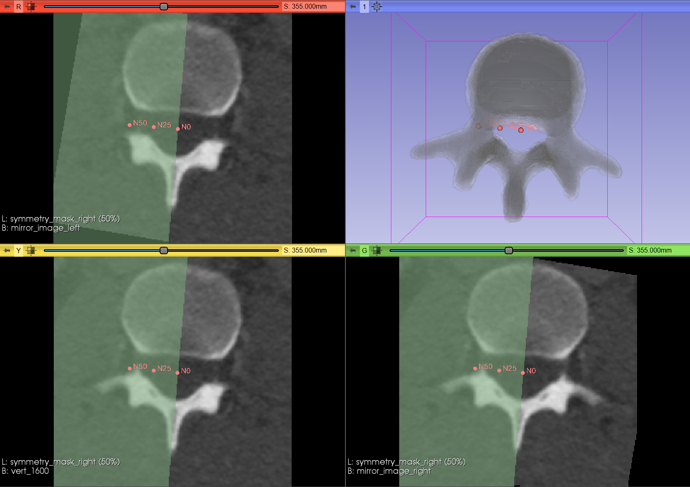
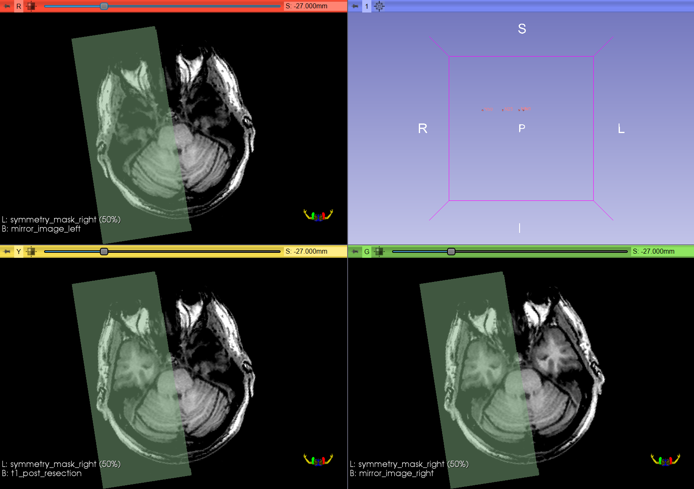

# mirror_symmetry

Detect the plane of mirror symmetry of a 3D nifti image based on rigid 
registration using the NiftyReg tool reg_aladin.



Visualisation of a CT image cropped to a lumbar vertebra (bottom left) and the 
two images created by mirroring one side across the detected symmetry plane in 
3D Slicer (4.9.0).
The top image consists of the mirrored left side of the vertebra, and the 
bottom right image consists of the mirrored right side. All images have the 
mask indicating the right side of the head as an overlay as well as the 
fiducial markers of a point on the symmetry plane (N0) and points along the 
normal direction starting from N0 (N5, N25, N50).




Corresponding images of a T1 weighted post resection head MRI.

## Installation

### NiftyReg

This package uses the NiftyReg package for its registration component, so 
first make sure to [install NiftyReg](https://github.com/KCL-BMEIS/niftyreg/wiki/install).


### `mirror_symmetry` package

Using [conda](https://conda.io/docs/) environments is recommended:

```shell
$ conda create -n "mirror_sym" -y
$ conda activate mirror_sym
(mirror_sym) $ git clone "https://github.com/KCL-BMEIS/mirror_symmetry" --depth 1
(mirror_sym) $ pip install "./mirror_symmetry"
```


## Usage

```
$ conda activate mirror_sym
(mirror_sym) $ mirror_symmetry_tool -h
usage: mirror_symmetry_tool [-h] [--save_path SAVE_PATH]
                            [--direction DIRECTION] [--create_fiducials]
                            [--create_mask] [--mirror_image] [--gpu]
                            image

Detect mirror symmetry plane. The symmetry plane determined in point-normal
form is printed. Optional binary mask that splits the image into the two
symmetric regions can be saved. Optional two symmetric images can be created
by mirroring the sides across the symmetry plane.

positional arguments:
  image                 Nifti image to be processed.

optional arguments:
  -h, --help            show this help message and exit
  --save_path SAVE_PATH, -p SAVE_PATH
                        Path to folder in which files are saved. Folder will
                        be created if it does not exist.
  --direction DIRECTION, -d DIRECTION
                        The direction of expected symmetry, e.g. when an image
                        has a symmetry close to the left-right direction,
                        either "left"/"l" or "right"/"r" can be specified. If
                        the mask is saved, the value 1 will correspond to the
                        direction specified here. Expected values: left,
                        right, anterior, posterior, superior, inferior and the
                        corresponding first letters, either lower case or
                        upper case.
  --create_fiducials, -f
                        Flag to save a slicer compatible csv file containing
                        fiducials visualising the normal vector of the
                        symmetry plane.
  --create_mask, -c     Flag to save a binary symmetry mask.
  --mirror_image, -m    Flag to save two images created by mirroring one side
                        across the symmetry plane.
  --gpu, -g             Flag to use CUDA for the registration.
```


## Example

```
$ mirror_symmetry_tool t1.nii.gz --mirror_image --create_mask -p ./t1 -d R -f
The detected symmetry plane is described by the following information: Point on
the plane, normal and distance to the origin (Hessian normal form: n x = -d).
In voxel coordinates:
point:    [ 127.99  127.97   87.10],
normal:   [   0.01    0.03    1.00],
distance: -91.91367670137463.
In world coordinates:
point:    [   4.42    4.34  -25.76],
normal:   [   1.00   -0.01   -0.03].
```

Tested on Linux and Windows.
